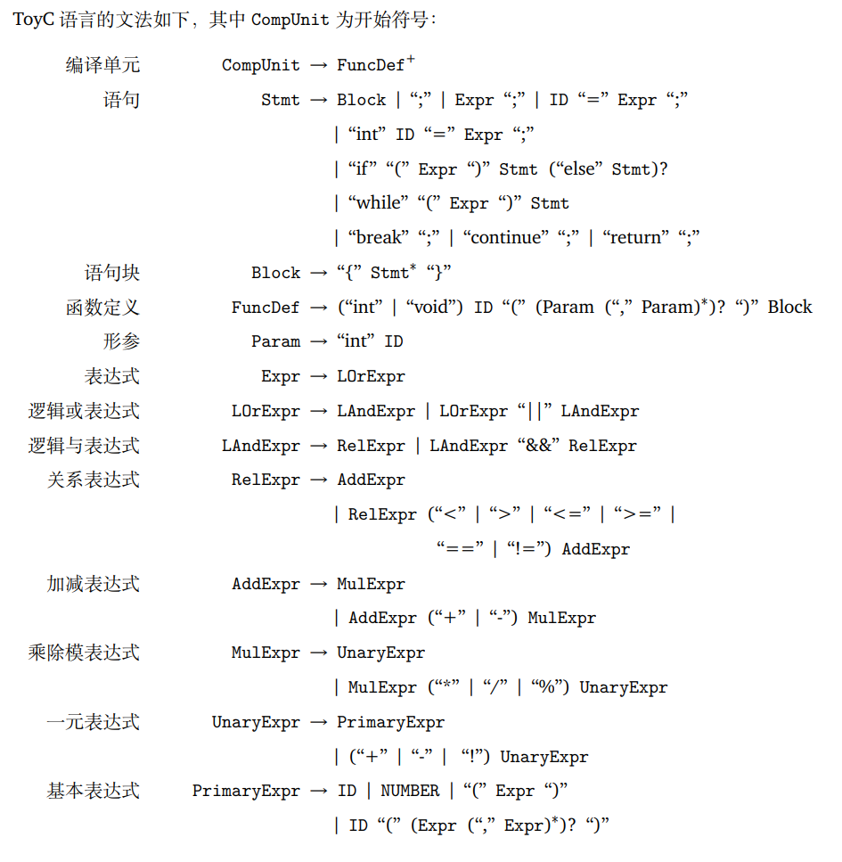

# ToyC - C 语言子集编译器

## 📖 目录

- [项目简介](#项目简介)
- [核心技术与亮点](#核心技术与亮点)
- [支持的语言特性](#支持的语言特性)
- [快速开始](#快速开始)
- [使用方法](#使用方法)
- [批量测试](#批量测试)
- [输出示例](#输出示例)
- [项目结构](#项目结构)
- [技术文档](#技术文档)

---

## 项目简介

ToyC 是一个基于现代编译技术实现的 **C 语言子集编译器**，采用多阶段编译架构，支持将 C 代码编译为 **LLVM IR** 和 **RISC-V 汇编代码**。

### 编译流程

```
C 源代码 → 词法分析 → 语法分析 → AST → LLVM IR 生成 → 寄存器分配 → RISC-V 汇编
```

### 技术栈

- **语言**: C++20
- **目标架构**: RISC-V 32-bit (RV32I)
- **中间表示**: LLVM IR (SSA 形式)
- **寄存器分配**: 线性扫描算法
	（原论文：https://web.cs.ucla.edu/~palsberg/course/cs132/linearscan.pdf）
	（关于本项目中实现的解释：[线性扫描算法核心思路.md](docs\线性扫描算法核心思路.md)）

---

## 核心技术与亮点

### 1. 完整的编译器前端

#### 词法分析器 (Lexer)
- **手工实现**的高效词法分析器
- 支持单字符和多字符运算符识别
- 完整的关键字、标识符、数字字面量处理
- 支持注释和空白符过滤

#### 语法分析器 (Parser)
- **递归下降**解析算法
- 完整的表达式优先级处理
- 支持复杂控制流语句嵌套
- 作用域管理和符号表维护

#### 抽象语法树 (AST)
- 面向对象的节点设计
- 支持语法树可视化输出
- 类型检查和语义分析

### 2. LLVM IR 代码生成

- **SSA 形式**的中间代码生成
- 支持 phi 节点自动插入
- **控制流图 (CFG)** 构建
- 基本块管理和跳转优化
- 函数调用约定实现
- **短路求值**优化（逻辑运算符 `&&`, `||`）

### 3. 寄存器分配算法

实现了经典的 **线性扫描寄存器分配算法** (Linear Scan Register Allocation)：

#### 核心特性
- **活跃区间计算**: 精确分析变量生命周期
- **物理寄存器映射**: 符合 RISC-V 调用约定
  - `a0-a7`: 参数寄存器
  - `t0-t6`: 临时寄存器  
  - `s0-s11`: 保存寄存器
- **溢出处理**: 自动栈分配和加载/存储生成
- **参数处理**: 支持多参数函数调用（前 8 个通过寄存器，其余通过栈）

#### 算法优势
- **时间复杂度**: O(n log n)，远优于图着色算法
- **空间效率**: 高效利用寄存器，减少内存访问
- **工业级实现**: 被广泛应用于 JVM、V8 等生产环境

详细算法说明见：[docs/线性扫描算法核心思路.md](docs/线性扫描算法核心思路.md)

### 4. RISC-V 代码生成

#### 支持的指令集
- **算术运算**: `add`, `sub`, `mul`, `div`, `rem`
- **逻辑运算**: `and`, `or`, `xor`, `not`
- **比较运算**: `slt`, `seqz`, `snez`
- **控制流**: `beq`, `bne`, `blt`, `bge`, `j`, `jal`, `jalr`, `ret`
- **内存访问**: `lw`, `sw`（字对齐）

#### 调用约定
完全符合 **RISC-V ABI** 规范：
- 参数传递：`a0-a7` (前 8 个参数)
- 返回值：`a0`
- 返回地址：`ra`
- 栈指针：`sp`
- 帧指针：`s0`（可选）

### 5. 多种输出模式

支持灵活的编译输出：
- **AST**: 树形结构可视化
- **LLVM IR**: 标准 LLVM IR 格式
- **Assembly**: RISC-V 汇编代码
- **All**: 同时输出以上所有内容

---

## 支持的语言特性



### 数据类型
- `int` - 32 位有符号整数
- `void` - 无返回值类型

### 运算符
| 类型 | 运算符 |
|------|--------|
| 算术 | `+`, `-`, `*`, `/`, `%` |
| 比较 | `==`, `!=`, `<`, `>`, `<=`, `>=` |
| 逻辑 | `&&`, `||`, `!` |
| 一元 | `+`, `-`, `!` |
| 赋值 | `=` |

### 控制流
- `if` / `if-else` - 条件分支
- `while` - 循环
- `break` - 跳出循环
- `continue` - 继续下次迭代
- `return` - 函数返回

### 高级特性
- ✅ 函数定义和调用
- ✅ 递归函数支持
- ✅ 多参数传递
- ✅ 作用域和变量遮蔽
- ✅ 块级作用域 `{ ... }`
- ✅ 短路求值优化
- ✅ 运算符优先级和结合性

---

## 快速开始

### 环境要求

- **必需**:
  - g++ (支持 C++20)
  - make
  - bash

- **可选** (用于生成对比输出):
  - clang
  - riscv32-unknown-elf-gcc

### 安装依赖 (Ubuntu/WSL)

```bash
sudo apt update
sudo apt install build-essential clang
```

### 编译项目

```bash
# 克隆或下载项目后
cd C-SubsetCompilerUsingLLVM

# 构建编译器
make build

# 或直接运行测试（会自动构建）
make test
```

---

## 使用方法

### 命令行选项

```bash
./toyc <input_file> [options]
```

**选项说明**:
- `--mode <mode>`: 输出模式
  - `ast` - 抽象语法树
  - `ir` - LLVM IR
  - `asm` - RISC-V 汇编 (默认)
  - `all` - 所有输出
- `--output <file>`: 输出到文件（默认为 stdout）
- `--target <arch>`: 目标架构（默认 `riscv32`）

### 示例用法

#### 1. 编译到 RISC-V 汇编

```bash
./toyc examples/compiler_inputs/01_minimal.c --mode asm
```

#### 2. 生成 LLVM IR

```bash
./toyc examples/compiler_inputs/05_function_call.c --mode ir
```

#### 3. 查看 AST

```bash
./toyc examples/compiler_inputs/03_if_else.c --mode ast
```

#### 4. 输出到文件

```bash
./toyc examples/compiler_inputs/09_recursion.c --mode asm --output fib.s
```

#### 5. 从标准输入读取

```bash
cat test.c | ./toyc --mode asm
```

---

## 批量测试

### 默认测试（测试 examples/compiler_inputs）

```bash
make test
```

**输出结构**:
```
test/
├── asm/                       # 汇编代码
│   ├── 01_minimal_toyc.s      # ToyC 生成
│   ├── 01_minimal_clang.s     # Clang 生成（对比）
│   └── ...
└── ir/                        # LLVM IR
    ├── 01_minimal_toyc.ll
    ├── 01_minimal_clang.ll
    └── ...
```

### 测试自定义目录

```bash
# 测试指定目录下的所有 .c 文件
make test TEST_SRC_DIR=path/to/your/test/folder

# 例如
make test TEST_SRC_DIR=examples/multi_func
```

### 仅生成汇编或 IR

```bash
# 仅汇编
bash scripts/generate_asm.sh [source_dir]

# 仅 IR
bash scripts/generate_ir.sh [source_dir]

# 示例
bash scripts/generate_asm.sh examples/single_func
```

### 验证输出结果

```bash
# 验证默认目录
make verify

# 验证自定义目录
make verify TEST_SRC_DIR=<your_directory>

# 示例
make verify TEST_SRC_DIR=examples/single_func
make verify TEST_SRC_DIR=examples/multi_func
```

### 清理输出

```bash
# 清理构建产物
make clean

# 清理测试输出
rm -rf test/asm test/ir
```

### 输出位置

无论测试哪个目录，输出都统一在 `test/` 目录下：

```
test/
├── asm/          # 汇编输出
│   ├── <file1>_toyc.s
│   ├── <file1>_clang.s
│   └── ...
└── ir/           # IR 输出
    ├── <file1>_toyc.ll
    ├── <file1>_clang.ll
    └── ...
```

---

## 测试用例说明

当前项目包含以下测试用例（位于 `examples/compiler_inputs/`）：

| 文件                         | 测试功能            |
| ---------------------------- | ------------------- |
| `01_minimal.c`               | 最小程序（空 main） |
| `02_assignment.c`            | 变量赋值            |
| `03_if_else.c`               | if-else 条件语句    |
| `04_while_break.c`           | while 循环和 break  |
| `05_function_call.c`         | 函数调用            |
| `06_continue.c`              | continue 语句       |
| `07_scope_shadow.c`          | 作用域和变量遮蔽    |
| `08_short_circuit.c`         | 逻辑短路求值        |
| `09_recursion.c`             | 递归函数            |
| `10_void_fn.c`               | void 函数           |
| `11_precedence.c`            | 运算符优先级        |
| `12_division_check.c`        | 除法检查            |
| `13_scope_block.c`           | 块作用域            |
| `14_nested_if_while.c`       | 嵌套控制流          |
| `15_multiple_return_paths.c` | 多返回路径          |